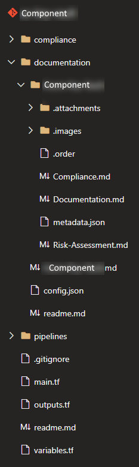

# Azure App Service Documentation

Component Id: azappservice  
Component Version: 1.0.0  
Page Last Modified: {date}  

[[_TOC_]]

The [Azure App Service](https://azure.microsoft.com/en-us/services/app-service/web/) component module delivers the automated provisioning of an Azure Web App component, resulting in a secure deployment of the resource, which can be used to host your web application.

## Component structure

- `compliance` - All Components which deploy resources to test the compliance against an environment have this folder. It contains a ready to go deployment with pipeline which deploys the Component to Azure.
- `documentation` - Component documentation.
  - `Azure-App-Service` - Container named after the Azure resource.
    - `Compliance.md` - Documentation on the component's compliance to the security frameworks and description of policies that are in scope for it.
    - `Documentation.md` - Detailed information on the component's capabilities (this document).
    - `Risk-Assessment.md` - Risk assessment document including the potential vulnerability areas and the mitigations that are being applied.
- `pipelines` - Any component pipeline. Example: Publishing component documentation.
- `main.tf` - Main Terraform component file.
- `outputs.tf` - Terraform output specification.
- `readme.md` - Technical documentation for deploying the component.
- `variables.tf` - Defining the variables used in the component.

## Governance

### Compliance

The compliance is ensured by testing the component on an Azure subscription, which has set of policies, defined by CIS, NIST and ISO27001 applied to it, ensuring that is compliant on these applicable policies:

- Managed identity should be used in your Web App
- FTPS should be required in your Web App
- Ensure that 'HTTP Version' is the latest, if used to run the Web app
- Latest TLS version should be used in your Web App
- Ensure that {{ used framework }} version is the latest, if used as a part of the Web app
- Authentication should be enabled on your web app

### Monitoring

#### Security

Access/audit logs, as well as any other logs generated by the App can be accessed by enabling the Diagnostic settings option. Like in many cases, the logs can be sent to a Log Analytics workspace, archived to a storage account or streamed to an event hub. By default, the logs will be sent to a storage account and stored for 30 days. The list of the logs is as follows:
- AppServiceAntivirusScanAuditLogs
- AppServiceHTTPLogs
- AppServiceConsoleLogs
- AppServiceAppLogs
- AppServiceFileAuditLogs
- AppServiceAuditLogs
- AppServiceIPSecAuditLogs
- AppServicePlatformLogs

#### Metrics

Function App relies on Azure Monitor and Application Insights to collect monitoring data. Azure Monitor Metrics are enabled when the Web App is provisioned and provides a significant amount of metrics to help with performance monitoring and troubleshooting. Application Insights can also be enabled on a per Web App basis.

Metrics from Azure Monitor:

- Average memory working set
- Average response time (deprecated)
- Connections
- Current Assemblies
- Data In
- Data Out
- File system usage
- Function execution count
- Function execution units
- Gen 0 garbage collections
- Gen 1 garbage collections
- Gen 2 garbage collections
- Handle count
- Health check status
- Http 101
- Http 2xx
- Http 3xx
- Http 401
- Http 403
- Http 404
- Http 406
- Http 4xx
- Http server errors
- IO other bytes per second
- IO other operations per second
- IO read bytes per second
- IO read operations per second
- IO write bytes per second
- IO write operations per second
- Memory working set
- Private bytes
- Requests
- Requests in application queue
- Response time
- Thread count
- Total app domains
- Total app domains unloaded

Data collected by Azure Application Insights:

- Availability
- Availability test results count
- Test duration
- Browser page load time
- Client processing time
- Page load network connect time
- Receiving response time
- Send request time
- Browser exceptions
- Dependency failures
- Exceptions
- Failed requests
- Server exceptions
- ASP.NET request execution time
- ASP.NET request rate
- ASP.NET requests in application queue
- Available memory
- Exception rate
- Process CPU
- Process CPU (all cores)
- Process IO rate
- Process private bytes
- Processor time
- Dependency calls
- Dependency duration
- Server requests
- Server response time
- Data point count
- Data point volume
- Events
- Page view load time
- Page views
- Sessions
- Traces
- Users
- Users, authenticated

#### Backup Monitoring

This section is not relevant as backups are not part of this component.

### Risk assessment

[Risk assessment](Risk-Assessment) for the Azure App Service component is documented separately.

## Authentication

Azure App Service Web Apps feature both data and management planes for authentication. On the management plane the Azure Portal and [APIs](https://docs.microsoft.com/en-us/rest/api/appservice/webapps) is available to perform configuration changes, where Azure AD with a set of roles handles the authentication.

On the data plane, Azure allows Function Apps to leverage Azure AD as an identity provider to be authenticated by the Web App itself. While other major identity providers are also available, out of the box the component supports Azure AD only.

A Web App also has the option to be assigned an identity in Azure AD, allowing to interact with other Azure services. This is one of the requirements to achieve the desired security compliance level.

### Role Based Access Control

Azure App Service Web App supports built-in Azure role-based access control (Azure RBAC) to control the App Service settings.

### Available Roles

In addition to the standard owner, contributor and reader roles which can be applied on the scope of an individual Web App, there are additional App Service specific roles:

- Managed Application Contributor - allows for creating managed application resources
- Managed Application Operator - lets you read and perform actions on managed application resources
- Managed Application Reader - lets you read resources in a managed app and request JIT access

## Backup

The Web Apps provisioned on a Web App Service are stateless in their nature. While native backup options are available for the modules by Azure, their availability varies based on the App Service Plan pricing tier. Thus, the application code is recommended to be kept in a versioned code repository as part of the software release pipeline. Any stateful information accessed by the Web App is outside the scope of the App Service Plan backup requirements and should be backed up at the level of the peristent storage component level.

### Data and Encryption

#### Encryption in Transit

App Service Web Apps are typically accessed via HTTPS with the option to enable FTPS access. Unencrypted HTTP traffic is disabled upon the automatic creation of the Azure resource. TLS version 1.2 is also enforced to enable the required compliance level.

#### Encryption at rest

The Web App that is being executed is stateless and does not store any persistent data. Optionally the web application can [introduce data encryption](https://docs.microsoft.com/en-us/azure/app-service/configure-encrypt-at-rest-using-cmk) by utilizing a storage account and a Key Vault with customer managed keys. The App Service itself is backed by Microsoft Storage accounts, which are always [encrypted](https://docs.microsoft.com/en-us/security/benchmark/azure/baselines/app-service-security-baseline) with Microsoft managed keys bey default.

If a database is required for a Web App to interact with, the encryption at rest will be covered fully by the PaaS database.

### Default component values

When the App Service Web App resource is being provisioned, the user has the option to choose the parameters of the final resource. If no values are provided, default values are included. Some of these values, emphasized in bold, are mandatory to ensure the resource compliance to the CSF:

| Parameter | Default value |
|--|--|
| Deployment region | West Europe |
| Hosting OS | Windows |
| Runtime Stack | **The latest available for the selected runtime** |
| Continuous deployment | Disable |
| HTTP version | **2.0** |
| HTTPS only | **True** |
| Minimum TLS Version | **1.2** |
| Remote debugging | **Off** |
| Always on | Off |
| Client certificate mode | Require |
| FTP state | **Not allowed** |
| Publish | Code |
| Managed identity type | **System assigned** |
| Authentication provider | Microsoft |
| Diagnostic settings | All logs stored in a storage account for 30 days |

Parameters in **bold** signify the values required by the compliance policy.

## Network Connectivity

Significant networking differences are present between different App Service Plans, that are used to host a Web App. More expensive Premium App Service plans allow this via Private Endpoints. As this is not controlled on a Web App scope, this functionality is detailed in the App Service Plan component documentation.

### Access from Internet

App Service Web Apps are typically used from both internal Azure infrastructure and external networks. If there is a need to limit access to your Web App, each App Service [supports](https://docs.microsoft.com/en-us/azure/app-service/app-service-ip-restrictions) inbound IP address restrictions and private site access as a connectivity limitation option both for public IP addresses or Azure VNETs. An additional option is to filter traffic based on headers. The following headers are supported:

- X-Forwarded-Host
- X-Forwarded-For
- X-Azure-FDID
- X-FD-HealthProbe

Private endpoints are also [supported](https://docs.microsoft.com/en-us/azure/app-service/networking/private-endpoint) for integrating the App Service resource into your Azure VNET. This functionality, however, requires a Private Endpoint component.

### Availability

Azure App Service Web Apps are highly available within a single Azure region, where the Web App is deployed. The underlying infrastructure ensures that in case of a hardware failure within Azure's datacenter, the App would be executed on a different host, enabling an SLA of [99.95%](https://azure.microsoft.com/en-us/support/legal/sla/app-service/v1_4/).

For Web Apps available across more than one region, a custom solution, based on [Microsoft's guidelines](https://docs.microsoft.com/en-us/azure/architecture/reference-architectures/app-service-web-app/multi-region) could be built. This, however, requires using additional components.
